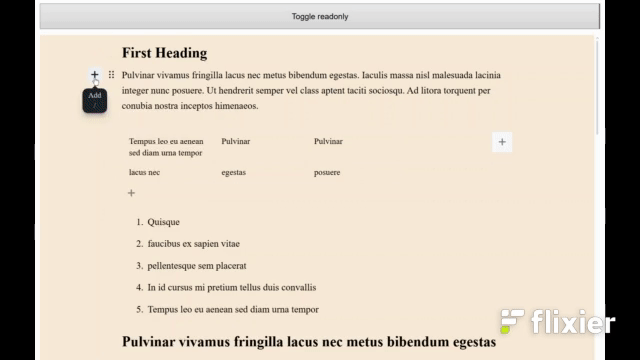

# Editor.js Accordion Block

A customizable **Accordion block tool** for [Editor.js](https://editorjs.io/) that lets you group and toggle visibility of multiple blocks (headings, paragraphs, tables, images, etc.) under a collapsible title. All styles are customizable




---

## Features

- Group any number of Editor.js blocks under an expandable/collapsible section.
- Works in both **edit** and **read-only** modes.
- Configurable default expanded state and block count.
- Fully styleable via **CSS overrides**.
- Optional animations.
- Max block count enforcement.

---

## Installation

```bash
npm install editorjs-accordion-block
```

or via CDN:

```html
<script src="https://cdn.jsdelivr.net/npm/editorjs-accordion-block"></script>
```

## Usage

### 1. Register in Editor.js

```js
import EditorJS from '@editorjs/editorjs';
import Accordion from 'editorjs-accordion-block';

const editor = new EditorJS({
  holder: 'editor',
  tools: {
    accordion: {
      class: Accordion,
      // optional config
      config: {
        defaultExpanded: true,
        maxBlockCount: 10,
        disableAnimation: false,
        overrides: {
          styles: {
            blockWrapper: 'background-color: lightyellow;',
            blockContent: 'border-left: 2px solid #ccc;',
            lastBlockContent: 'border-bottom: 2px solid #ccc;',
            insideContent: 'padding: 10px;',
          },
        },
      },
    },
  },
});
```

### 2. Using in the Editor

- Title: Editable inline text for the accordion heading.

- Block count: Number of following blocks to include in the accordion group.

- Default expanded: Whether the accordion starts open in read mode.

- Controlled blocks can be any Editor.js block type (header, paragraph, table, list, image, etc.).

### 3. Saving Data

`save()` returns:

```json
{
  "type": "accordion",
  "data": {
    "settings": {
      "blockCount": 3,
      "defaultExpanded": true
    },
    "title": "My Accordion"
  }
}
```

### Configuration Options

| Option                                  | Type          | Description                                                                   | Default     |
| --------------------------------------- | ------------- | ----------------------------------------------------------------------------- | ----------- |
| `defaultExpanded`                       | `boolean`     | Whether accordion is expanded in read mode by default.                        | `true`      |
| `overrides.classes.wrapper`             | `string`      | Extra CSS classes for the accordion wrapper.                                  | `""`        |
| `overrides.classes.settings`            | `string`      | Extra classes for settings button container.                                  | `""`        |
| `overrides.classes.title`            | `string`      | Extra classes for the titlec.                                  | `""`        |
| `overrides.classes.settingsPopover`     | `string`      | Extra classes for settings popover container.                                 | `""`        |
| `overrides.classes.settingsContent`     | `string`      | Extra classes for popover content.                                            | `""`        |
| `overrides.classes.settingsBlockConfig` | `string`      | Extra classes for popover block config wrapper.                               | `""`        |
| `overrides.classes.settingsCheckbox`    | `string`      | Extra classes for settings checkbox input.                                    | `""`        |
| `overrides.classes.settingsDelimiter`   | `string`      | Extra classes for popover delimiter element.                                  | `""`        |
| `overrides.styles.blockWrapper`         | `string`      | CSS rules applied to `.ce-block[data-readonly] .accordion-wrapper`.           | `undefined` |
| `overrides.styles.blockContent`         | `string`      | CSS rules applied to `.ce-block__content` when editor is read-only.           | `undefined` |
| `overrides.styles.lastBlockContent`     | `string`      | CSS rules applied to the last block’s content.                                | `undefined` |
| `overrides.styles.insideContent`        | `string`      | CSS rules applied to the content inside the block (`.ce-block__content > *`). | `undefined` |
| `overrides.settingsIcon`                | `HTMLElement` | Custom element for settings icon.                                             | `undefined` |
| `disableAnimation`                      | `boolean`     | Disables expand/collapse animations.                                          | `false`     |
| `maxBlockCount`                         | `number`      | Maximum allowed block count in accordion.                                     | `10`        |
